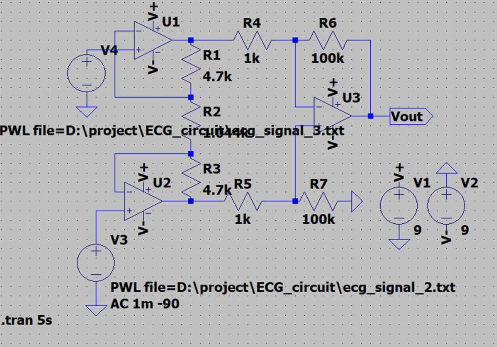
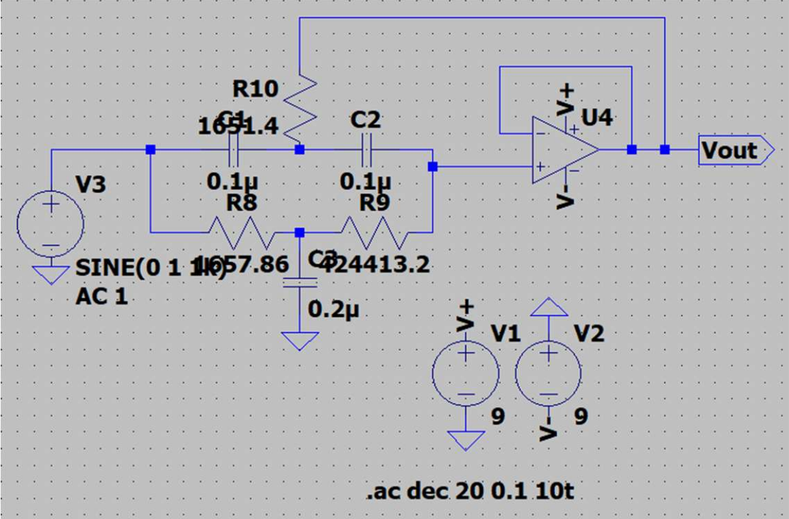
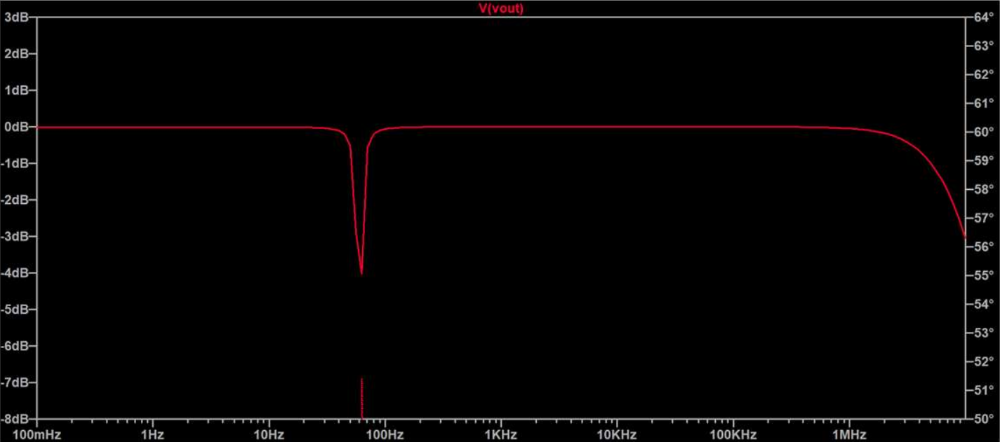
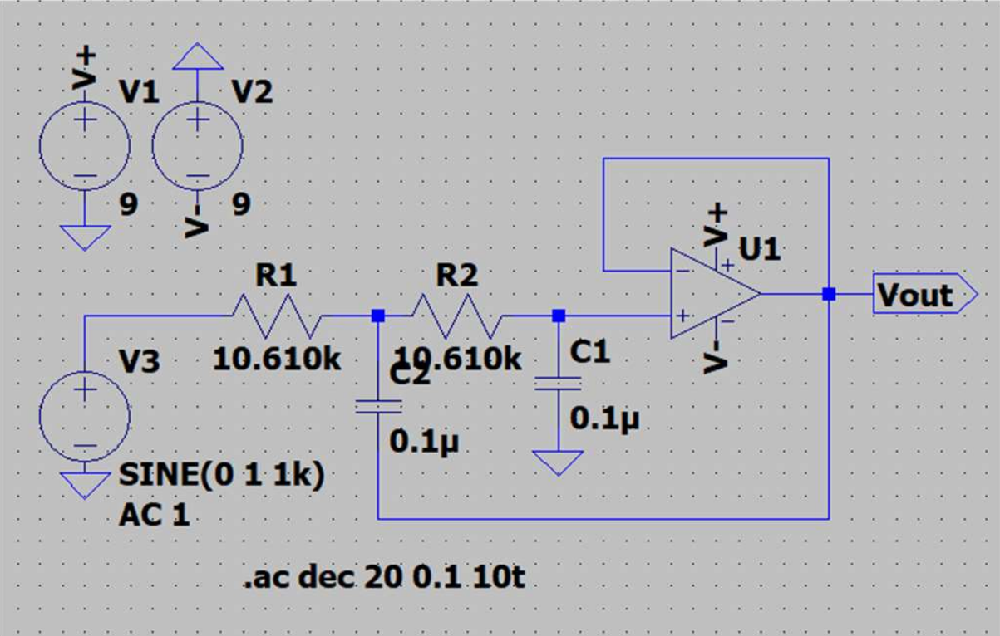
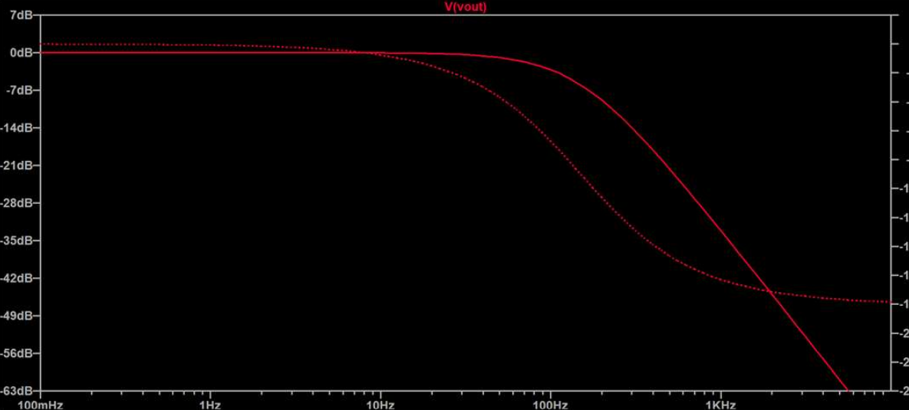
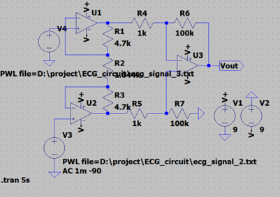
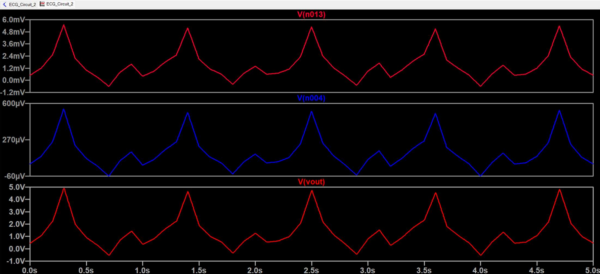
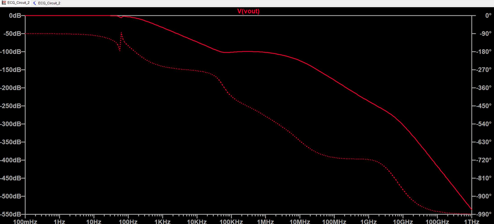

# Low-Power ECG Circuit

This repository contains the design, simulation, and documentation for a low-power analog ECG (Electrocardiogram) circuit. The project focuses on amplifying and filtering bio-potential signals from the human body to capture clean, interpretable ECG waveforms. This design is well-suited for low-cost, portable, and wearable medical applications.

---

## Table of Contents

- [1. Introduction](#1-introduction)
- [2. Circuit Design](#2-circuit-design)
- [3. Circuit Integration and Testing](#3-circuit-integration-and-testing)
- [4. Simulation Results](#4-simulation-results)
- [5. Hardware Results](#5-hardware-results)
- [6. Inference](#6-inference)
- [7. Conclusion](#7-conclusion)
- [8. References](#8-references)
- [9. Contributors](#9-contributors)

---

## 1. Introduction

An electrocardiogram (ECG) is a diagnostic technique used to monitor the electrical activity of the heart. The ECG waveform consists of characteristic components such as the P-wave, QRS complex, and T-wave, which represent different phases of the cardiac cycle.

Due to the low amplitude of these signals and the presence of external/internal noise, effective signal conditioning is necessary. This project presents a three-stage, low-power ECG circuit with:

- High gain instrumentation amplification
- Notch filtering of 60 Hz powerline noise
- Low-pass filtering of high-frequency muscle artifacts

---

## 2. Circuit Design

### 2.1 Instrumentation Amplifier (INA)

- Amplifies low-level differential ECG signals
- Provides high Common Mode Rejection Ratio (CMRR)
- Gain set to approximately 1000 using precision resistors

**Circuit Diagram:**



---

### 2.2 Notch Filter

- Removes 60 Hz powerline interference
- Designed with center frequency f₀ = 60 Hz and Q = 8
- Targets a narrow frequency band without distorting the overall signal

**Circuit Diagram:**



**Simulation Output:**



---

### 2.3 Low-Pass Filter

- Attenuates high-frequency noise (e.g., muscle tremors)
- Second-order configuration with a 150 Hz cutoff
- Meets AHA guidelines for ECG signal clarity

**Circuit Diagram:**



**Simulation Output:**



---

## 3. Circuit Integration and Testing

The circuit stages are connected as follows:
```
Instrumentation Amplifier → Notch Filter → Low-Pass Filter
```

### Testing Methods

1. **LTspice Simulation Input**  
   - The ECG waveform was applied using a file-based voltage source in LTspice (`PWL` input with ECG waveform data).
   - This mimicked a realistic ECG signal without requiring an external function generator.

2. **Real ECG Input (Human Subject)**  
   - Lead II configuration:
     - Right wrist → Negative input  
     - Left ankle → Positive input  
     - Right ankle → Ground  
   - Use of 9V battery power for safety

### Expected Output

- Clean ECG waveform with visible:
  - P-wave
  - QRS complex
  - T-wave

---

## 4. Simulation Results

The circuit was simulated using **LTspice**. The ECG waveform was applied using a file-based voltage source, allowing for a realistic biomedical signal to be processed through the analog stages.

The simulation included:

- **Transient Analysis**: To observe the time-domain response of the circuit to a typical ECG waveform.
- **AC Analysis**: To evaluate the frequency response of the circuit, particularly the filter behavior.
- **Overall Circuit View**: To visualize the complete schematic used for simulation.

### Overall ECG Circuit Diagram (LTspice Schematic)



### Transient Analysis (ECG Waveform Output)

This shows how the input ECG waveform is processed over time. The amplification and filtering stages yield a smooth, readable ECG signal.



### AC Analysis (Frequency Response)

This plot highlights the frequency characteristics of the circuit, validating the design of the low-pass and notch filters.



---

## 5. Hardware Results

During practical hardware implementation, the **notch filter stage was removed**. Although the simulation showed successful 60 Hz suppression, the actual notch filter did not behave as expected. It failed to attenuate the 60 Hz interference consistently and introduced distortion in the ECG signal. This may be due to component inaccuracies, low Q-factor realization, or real-world impedance mismatches.

As a result, only the **instrumentation amplifier** and the **low-pass filter** were used in the hardware prototype, which still produced usable ECG signals for basic visualization.

### Observations:

- Output waveforms still showed recognizable P-waves, QRS complexes, and T-waves.
- Powerline noise was partially mitigated using physical isolation and battery-based power supply.
- Patch cords and disposable electrodes were used for human testing.
- The subject was in a resting position, and care was taken to avoid motion artifacts.

**Hardware Setup Image:**


**Oscilloscope Output (Human Subject):**


**Test Subject with Electrodes:**


---

## 6. Inference

- The ECG circuit effectively captured and processed real-time cardiac signals.
- Amplification and low-pass filtering alone were sufficient for a basic ECG waveform.
- Simulation and hardware performance were generally consistent except for the notch filter stage.

---

## 7. Conclusion

This project demonstrates that a low-power, analog ECG circuit can be constructed using readily available components to acquire clear cardiac signals. The instrumentation amplifier and low-pass filter stages performed reliably. Future improvements could include:

- Replacing the notch filter with a better-designed active filter
- Integrating digital signal processing (DSP) for adaptive filtering
- Creating a wearable version of the circuit

---

## 8. References

1. [IEEE Xplore - Low-Power ECG Circuit Design](https://ieeexplore.ieee.org/stamp/stamp.jsp?tp=&arnumber=9531733)  
2. [Instructables - ECG Circuit](https://www.instructables.com/Electrocardiogram-ECG-Circuit/)  
3. [Instructables - ECG Circuit (Part 2)](https://www.instructables.com/Electrocardiogram-ECG-Circuit-2/)  
4. [Instructables - ECG Circuit (Part 3)](https://www.instructables.com/Electrocardiogram-ECG-Circuit-3/)

---

## 9. Contributors

- Pranav Maruti Shanbhag (USN: 4NI24EC407)   
- Anirudha Jayaprakash (USN: 4NI23EC014)
- Adithya Y (USN: 4N23EC005) 
- Aneesh R Kulkarni (USN: 4NI23EC013)  
