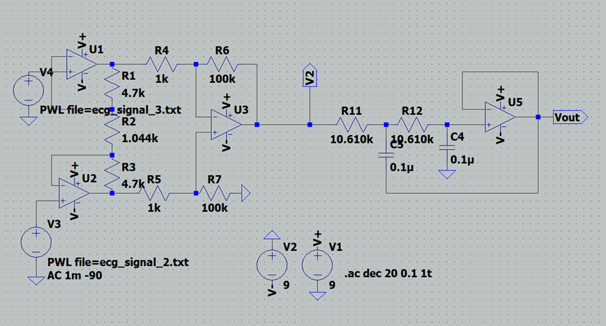
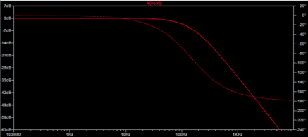
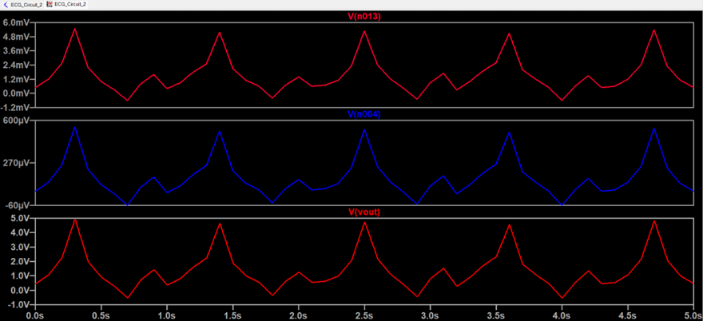
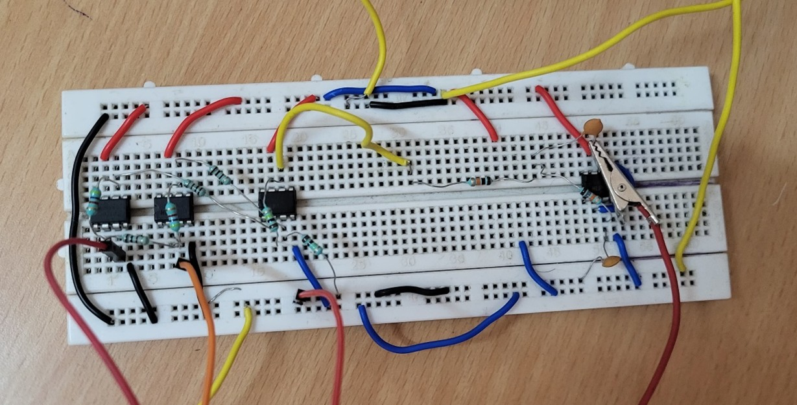
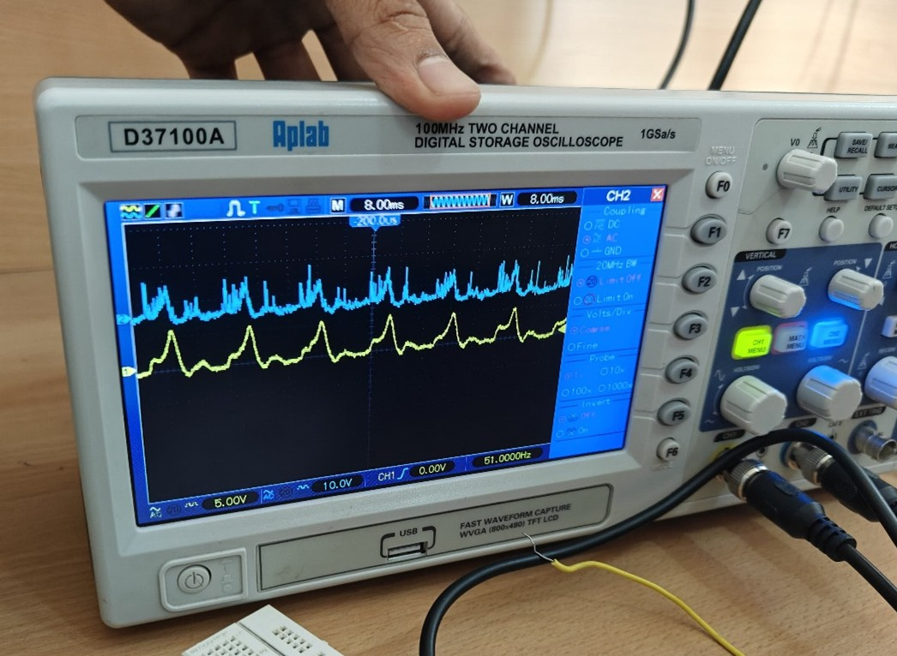
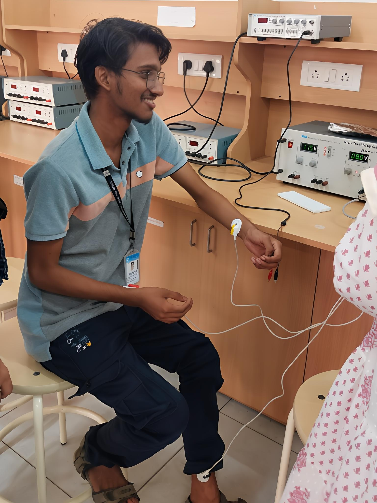

# Cardio Tracker - Low-Power ECG Circuit

This project documents the design, simulation, and hardware implementation of a low-power analog ECG (Electrocardiogram) signal acquisition circuit, named **Cardio Tracker**. The system captures heart activity and displays key waveform features such as P-waves, QRS complexes, and T-waves with low noise and high clarity.

---

## Table of Contents

- [1. Introduction](#1-introduction)
- [2. Circuit Overview](#2-circuit-overview)
- [3. Working Methodology](#3-working-methodology)
- [4. Circuit Simulation](#4-circuit-simulation)
- [5. Hardware Implementation](#5-hardware-implementation)
- [6. Inference](#6-inference)
- [7. Conclusion](#7-conclusion)
- [8. References](#8-references)
- [9. Contributors](#9-contributors)

---

## 1. Introduction

An electrocardiogram (ECG) records the heart’s electrical activity via skin electrodes. These signals are typically weak and noisy, requiring amplification and filtering.

This project focuses on building a **two-stage ECG circuit** comprising:
- Instrumentation Amplifier
- Low-Pass Filter

The objective is to deliver a clear ECG signal suitable for portable and battery-powered health monitoring applications.

---

## 2. Circuit Overview

Below is the complete ECG signal conditioning circuit diagram simulated and implemented for the project.

### Full Circuit Diagram

---

## 3. Working Methodology

### Stage 1: Instrumentation Amplifier

- Amplifies low-level differential signals
- High Common Mode Rejection Ratio (CMRR)
- Gain set to approximately 1000
- Essential for boosting ECG signal for further processing

**Circuit Diagram:**

---

### Stage 2: Low-Pass Filter

- Attenuates high-frequency noise (e.g., EMG interference)
- Second-order filter with 150 Hz cutoff (as per AHA guidelines)
- Helps clean the amplified ECG signal before visualization

**Circuit Diagram:**

---

## 4. Circuit Simulation

Simulation was performed using **LTspice**. The ECG waveform was applied using a `.txt` file as a voltage source to replicate a real cardiac signal.

### Transient Analysis Output – Low-Pass Filter

### AC Analysis Output

### Transient Analysis Output

### Simulation Files

- [`ecg_circuit.asc`](simulations/ecg_circuit.asc) – LTspice simulation circuit  
- [`ECG_input.txt`](simulations/ECG_input.txt) – File-based input ECG waveform

---

## 5. Hardware Implementation

The circuit was constructed on a breadboard using both INA and low-pass filter stages. The hardware output combines both effects into a single waveform.

### Key Testing Notes:

- ECG input from human subject (Lead II configuration)  
- Powered using two 9V batteries for safety  
- Electrodes placed on right wrist, left ankle, and ground on right ankle  
- Output viewed on oscilloscope  

### Hardware Images

| Description                                | Image |
|--------------------------------------------|-------|
| **Hardware Setup (Breadboard Circuit)**     |  |
| **Combined Output from INA + LPF Stage**    |  |
| **Human Subject with Electrodes Attached**  | |

> We aim to continue this project by integrating it with **IoT technologies** such as **Bluetooth or Wi-Fi modules** for real-time wireless ECG monitoring and remote diagnostics.

---

## 6. Inference

- The **INA stage** successfully amplified the weak ECG signal  
- The **LPF stage** effectively reduced high-frequency noise  
- Simulation results from each stage matched expected behavior  
- Final hardware output displayed distinct P-waves, QRS complexes, and T-waves  
- The ECG signal was clear, interpretable, and suitable for further processing  

---

## 7. Conclusion

The **Cardio Tracker** ECG circuit demonstrates the effectiveness of using simple, low-power analog stages to obtain clean ECG signals. The use of battery power and passive components ensures portability and safety for personal health monitoring.

### Future Work:
- Integrate digital filtering for adaptive noise suppression  
- Add wireless transmission via Bluetooth or Wi-Fi  
- Develop a compact PCB version for wearable integration  

---

## 8. References

1. [IEEE Xplore: Low-Power ECG Circuit Design](https://ieeexplore.ieee.org/stamp/stamp.jsp?tp=&arnumber=9531733)  
2. [Instructables - ECG Circuit](https://www.instructables.com/Electrocardiogram-ECG-Circuit/)  
3. [Instructables - ECG Circuit (Part 2)](https://www.instructables.com/Electrocardiogram-ECG-Circuit-2/)  
4. [Instructables - ECG Circuit (Part 3)](https://www.instructables.com/Electrocardiogram-ECG-Circuit-3/)

---

## 9. Contributors

- Ballambettu Milan Shankar Bhat (USN: 4NI23EC019)  
- Pranav Maruti Shanbhag (USN: 4NI24EC407)  
- Adithya Y (USN: 4N23EC005)  
- Anirudha Jayaprakash (USN: 4NI23EC014)  
- Aneesh R Kulkarni (USN: 4NI23EC013)  
